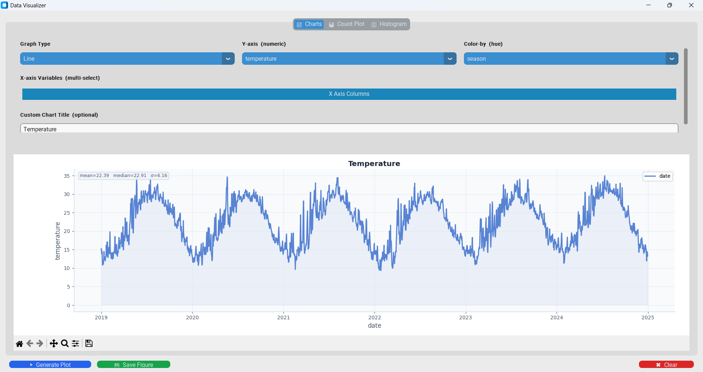
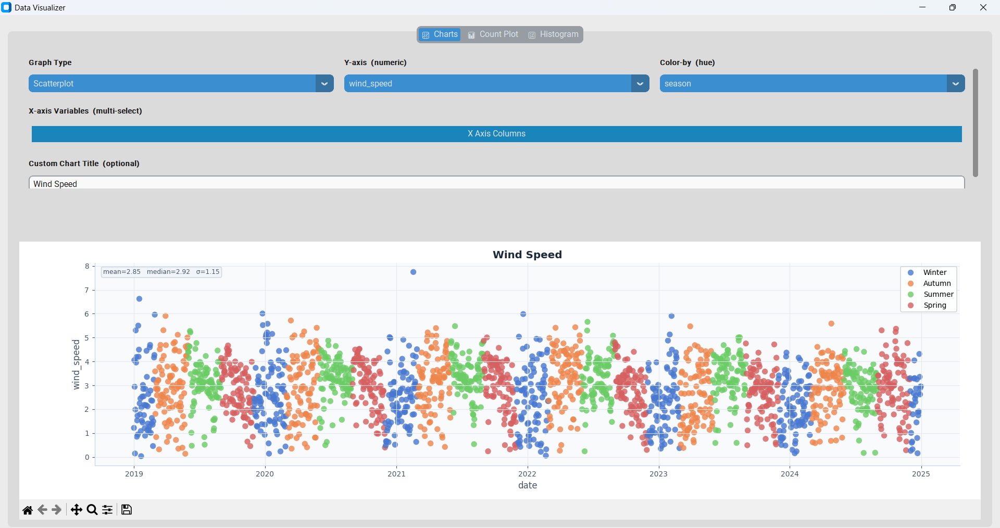

<p align="center">
    
</p>
<p align="center">
  <a href="https://github.com/hussiensharaf/A-CFG-Dynamic-Engine-for-dynamic-DSL-code-generation/blob/fix/optimization/LICENSE"></a>
	
	
	
</p>

<br>

## Table of Contents

- [Overview](#overview)
- [Features](#features)
- [Built With](#built-with)
- [Gallery](#gallery)
- [Project Structure](#project-structure)
  - [Project Index](#project-index)
- [Getting Started](#getting-started)
  - [Prerequisites](#prerequisites)
  - [Installation](#installation)
  - [Usage](#usage)
- [License](#license)

---

## Overview

**QueryFlow** is a lightweight ETL engine that lets you query, transform, and visualize data using familiar SQL syntax — no complex procedural code required.

Under the hood, it uses a **Context-Free Grammar (CFG)** core (powered by LEX & YACC) to parse your SQL-like queries and dynamically generate the equivalent Python/DSL code. Think of it as a bridge between SQL's readability and Python's ecosystem: you write a query, QueryFlow generates the code, and you instantly see the results.

It was built because data scientists shouldn't have to choose between the expressiveness of SQL and the flexibility of Python. QueryFlow gives you both — and benchmarks show it handles CSV, SQLite, and JSON operations faster than MS-SQL Server for most common ETL workloads.

---

## Features

### 🗄️ Data Sources

**Local:**
- **Databases:** SQLite, MSSQL
- **Flat Files:** CSV, JSON, XML, Excel, HTML
- **Media Files:** Images and Videos

**Remote:**
- **Google Earth Engine (GEE)** — for geospatial datasets

### 🖥️ GUI
- **Dark & Light Mode** — switch themes to suit your preference
- **Multi-tab workspace** — write and manage multiple queries side by side
- **SQL Editor** — with syntax highlighting and auto-formatting
- **Python Code Viewer** — see the generated Python code and edit it directly
- **Table View** — query results displayed in an interactive spreadsheet

### 📊 Visualization
Plot your results without leaving the app. Supported chart types: Scatter, Line, Bar, Count Plot, and Map — powered by Pandas, Matplotlib, and Seaborn.

---

## Built With

| Library | Purpose |
|---|---|
| **CustomTkinter** | Modern, responsive desktop UI |
| **PLY** (LEX & YACC) | Query parsing via Context-Free Grammar |
| **TkSheet** | Interactive spreadsheet / table view |
| **Pandas** | Data manipulation and analysis |
| **SQLAlchemy** | Database connectivity and management |
| **sqlparse** | SQL query parsing and formatting |
| **Matplotlib / Seaborn** | Data visualization |
| **OpenCV** | Image and video processing |
| **Google Earth Engine** | Geospatial data integration |

---

## Gallery

### CSV Example 1


### CSV Example 2


### DB Example 1


### DB Example 2


### GEE Example 1


### GEE Example 2


### Line Plot Visualization


### Scatter Plot Visualization


### Bar Plot Visualization


### Map Visualization


---

## Project Structure

```sh
└── QueryFlow/
    ├── LICENSE
    ├── app
    │   ├── __init__.py
    │   ├── compiler
    │   ├── core
    │   ├── cv
    │   ├── etl
    │   ├── gui
    │   └── utility.py
    ├── main.py
    ├── requirements.txt
    └── testing_datasets
        └── hotel_bookings.csv
```

### Project Index

<details open>
	<summary><b><code>QueryFlow/</code></b></summary>
	<details>
		<summary><b>__root__</b></summary>
		<blockquote>
			<table>
			<tr>
				<td><b><a href='https://github.com/hussiensharaf/A-CFG-Dynamic-Engine-for-dynamic-DSL-code-generation/blob/master/main.py'>main.py</a></b></td>
			</tr>
			<tr>
				<td><b><a href='https://github.com/hussiensharaf/A-CFG-Dynamic-Engine-for-dynamic-DSL-code-generation/blob/master/requirements.txt'>requirements.txt</a></b></td>
			</tr>
			</table>
		</blockquote>
	</details>
	<details>
		<summary><b>app</b></summary>
		<blockquote>
			<table>
			<tr>
				<td><b><a href='https://github.com/hussiensharaf/A-CFG-Dynamic-Engine-for-dynamic-DSL-code-generation/blob/master/app/utility.py'>utility.py</a></b></td>
			</tr>
			</table>
			<details>
				<summary><b>core</b></summary>
				<blockquote>
					Core engine logic and runtime extensions.
				</blockquote>
			</details>
			<details>
				<summary><b>etl</b></summary>
				<blockquote>
					<table>
					<tr>
						<td><b><a href='https://github.com/hussiensharaf/A-CFG-Dynamic-Engine-for-dynamic-DSL-code-generation/blob/master/app/etl/helpers.py'>helpers.py</a></b></td>
					</tr>
					<tr>
						<td><b><a href='https://github.com/hussiensharaf/A-CFG-Dynamic-Engine-for-dynamic-DSL-code-generation/blob/master/app/etl/core.py'>core.py</a></b></td>
					</tr>
					</table>
				</blockquote>
			</details>
			<details>
				<summary><b>cv</b> — Computer Vision / Media File Module</summary>
				<blockquote>
					<table>
					<tr>
						<td><b><a href='https://github.com/hussiensharaf/A-CFG-Dynamic-Engine-for-dynamic-DSL-code-generation/blob/master/app/cv/video_reader.py'>video_reader.py</a></b></td>
					</tr>
					<tr>
						<td><b><a href='https://github.com/hussiensharaf/A-CFG-Dynamic-Engine-for-dynamic-DSL-code-generation/blob/master/app/cv/details_extractor.py'>details_extractor.py</a></b></td>
					</tr>
					<tr>
						<td><b><a href='https://github.com/hussiensharaf/A-CFG-Dynamic-Engine-for-dynamic-DSL-code-generation/blob/master/app/cv/detector.py'>detector.py</a></b></td>
					</tr>
					<tr>
						<td><b><a href='https://github.com/hussiensharaf/A-CFG-Dynamic-Engine-for-dynamic-DSL-code-generation/blob/master/app/cv/operation_main.py'>operation_main.py</a></b></td>
					</tr>
					<tr>
						<td><b><a href='https://github.com/hussiensharaf/A-CFG-Dynamic-Engine-for-dynamic-DSL-code-generation/blob/master/app/cv/threading_main.py'>threading_main.py</a></b></td>
					</tr>
					<tr>
						<td><b><a href='https://github.com/hussiensharaf/A-CFG-Dynamic-Engine-for-dynamic-DSL-code-generation/blob/master/app/cv/folder_reader.py'>folder_reader.py</a></b></td>
					</tr>
					</table>
				</blockquote>
			</details>
			<details>
				<summary><b>compiler</b></summary>
				<blockquote>
					<table>
					<tr>
						<td><b><a href='https://github.com/hussiensharaf/A-CFG-Dynamic-Engine-for-dynamic-DSL-code-generation/blob/master/app/compiler/lex.py'>lex.py</a></b></td>
					</tr>
					<tr>
						<td><b><a href='https://github.com/hussiensharaf/A-CFG-Dynamic-Engine-for-dynamic-DSL-code-generation/blob/master/app/compiler/yacc.py'>yacc.py</a></b></td>
					</tr>
					<tr>
						<td><b><a href='https://github.com/hussiensharaf/A-CFG-Dynamic-Engine-for-dynamic-DSL-code-generation/blob/master/app/compiler/ast_nodes.py'>ast_nodes.py</a></b></td>
					</tr>
					</table>
				</blockquote>
			</details>
			<details>
				<summary><b>gui</b></summary>
				<blockquote>
					<table>
					<tr>
						<td><b><a href='https://github.com/hussiensharaf/A-CFG-Dynamic-Engine-for-dynamic-DSL-code-generation/blob/master/app/gui/ui_compiler.py'>ui_compiler.py</a></b></td>
					</tr>
					</table>
				</blockquote>
			</details>
		</blockquote>
	</details>
</details>

---

## Getting Started

### Prerequisites

- **Python 3.12**

### Installation

1. Clone the repository:

```sh
git clone https://github.com/hussiensharaf/A-CFG-Dynamic-Engine-for-dynamic-DSL-code-generation
```

2. Navigate to the project directory:

```sh
cd QueryFlow
```

3. Install dependencies:

```sh
pip install -r requirements.txt
```

### Usage

```sh
python main.py
```

---

## License

This project is licensed under the **MIT** License. See the [LICENSE](LICENSE) file for details.

---
